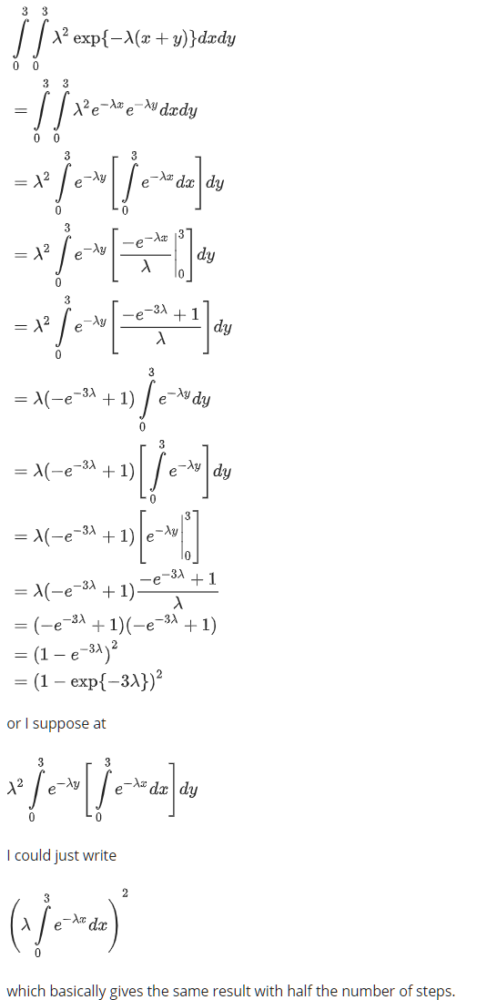

---
output:
  pdf_document: default
  html_document: default
---
# Module 2: Fundamentals of Probability, Random Variables, Joint Distributions + Collecting Data
***


**Module Sections:**

* Fundamentals of Probability
* Random Variables, Distributions, and Joint Distributions
* Gathering and Collecting Data
* Module 2: Homework


Module Content:

* [Section 2 Slides - Fundamentals of Probability](./files/M1/Lecture_Slides_02.pdf)
* [Section 3 Slides - Random Variables, Distributions and Joint Distributions](./files/M1/Lecture_Slides_03.pdf)
* [Section 4 Slides - Gathering and Collecting Data](./files/M1/Gathering_Data.pdf)


## Fundamentals of Probability

### Set Theory

* A _sample space_ is collection of all possible outcomes
* An _event_ is any collection of outcomes - could be one, all or none
* If the outcome is a member of an event, the event is said to have _occured_
* Event B is said to be _contained_ by A, if all outcomes in B also are in A

* This is the basis of set theory and used widely in probability, although there are some differences between set and probability theory
* If there is no symbol, then this usually means intersection AB in probability - in set theory we would write an inverted U e.g. $A \cap B$
* A and B are mutually exclusive (disjoint in set theory) if they have no outcomes in common
* A and B are  exhaustive (complimentary in set theory) if their union is S (the entire sample space)
* A and B are both mutually exclusive and exhaustive, their union is equal to the sample space but they have no events in common - they are a partition of the sample space

### Defining Probability

We assign every event a number P(A) which is the prob. the event will occur

1 We require that the probability is greater than one for all events in the sample space - P(A) >= 0 for all A c S
2 The entire sample space must be equal to one - P(S) = 1
3 For any sequence of disjoint sets, the prob. of the union of that sequence is equal to the sum of the probabilities of those events - A~1~, A~2~, ... , is P(V~i~) = $\sum_{i} P(A_i)$

So we have a sample space, and if it satisfies these three properties, then we call it a probability.  Sometimes this is referred to as a probability function or a probability distribution, but there is no standard terminology for all probability theory.  Set theory helps to prove aspects of probability mathematically, for the purposes on this course, we just need to know what some useful facts are.

* P(A^c^) = 1 - P(A) = 

The probability of A compliment, which is the event that contains all of the outcomes that are not in the event A, the probability of A compliment is just equal to 1 minus the probability of A.  This is useful if the probability of A comliment (P(A^c^)) is difficult to compute, where as the probability of A might be very easy to compute.

* $P (\emptyset)$ = 

The probability of the empty set is zero.

* If A ~c~ B then P(A) <= P(B) = 

If A is contained in B then the probability of A is less than or equal to the probability of B

* For all A, 0 <= P(A) <= 1 = 

For any events, the probability of that event is between 0 and 1.

* P(AUB) = P(A) + P(B) - P(AB) = 

Probability of A union B is just equal to the sum of the probabilities of those two events minus the probability of the their intersection.

* P(AB^c^) = P (A) - P(AB) = 

The probability of A times B complement is equal to the probability of A minus the probability of the intersection.


### An example

Suppose you have a finite sample space. Let the function n(.) give the number of elements in a set. 

Then define P(A) = n(A)/n(S). This is called a simple sample space, and it is a probability - we count the number of outcomes and divide by the number of possible outcomes in the sample space.

We can check that it satisfies the three axioms to ensure it is a probability:

1. P(A) will always be non-negative because it’s a count
2. P(S) will equal 1, by definition
3. P(AUB) = n(AUB)/n(S) = n(A)/n(S) + n(B)/n(S) = P(A) +P(B).

If you can put your experiment in to this sample space where each outcome is equally likely, we just need to count to calculate probabilities of events.  So for example, if you want to know how likely it is you will roll a specific number, say 6, on two dice, we calculate all the different ways that six occurs then divide this by all possible outcomes (sample space) - = 5 / 36 = or 13.9%  

### Another example

If the state of Massachusetts issues 6-character license plates, using one of 26 letters and 10 digits randomly for each character, what is the probability that I will receive an all digit license plate?

n(S) = 36 (26 + 10) possibilities for each of 6 characters = 36^6^ = 2.176b
n(A) = 10 possibilities (for digits only) for each of 6 characters = 10^6^ = 1m
so P(A) = .0005

This is _sampling with replacement_

*What if Massachusetts does not reuse a letter or digit?*

Now, in the sample space, there are 36 possibilities (26 + 10) for the 1st character, 35 left for the 2nd, and so on. 

n(S) = 36x35x34x33x32x31 = 36!/30! = 1.402b

Similarly, in the event, there are 10 possibilities for the 1st character, 9 left for the 2nd, and so on. 

n(A) = 10x9x8x7x6x5 = 10!/4! = 151k

so P(A) = 1.402b / 151k = .0001

This is _sampling without replacement_

### Ordered and Unordered Arrangements

In the examples so far, we have used a series of counting rules - combinatorics i.e. combinations of objects belonging to a finite set in accordance with certain constraints.

1. If an experiment has two parts, first one having m possibilities and, regardless of the outcome in the first part, the second one having n possibilities, then the experiment has m * n possible outcomes - this is what we do intuitively

2. Any ordered arrangement of objects is called a *permutation*. The number of different permutations of N objects is N! The number of different permutations of n objects taken from N objects is N!/(N-n)! This is the case in the license plate example previously given

3. Any unordered arrangement of objects is called a *combination*. The number of different combinations of n objects taken from N objects is N!/{(N-n)!n!}. We typically denote this $\binom{N}{n}$ - N (big objects) choose n (combinations). This is where the order of objects doesn't matter i.e. different orderings don't matter - we take out the ordering

So if we had 9 people who each wanted to shake hands, if order doesn't matter then it is a combination and we take 9 and choose 2 so it becomes:

9! / {(9-2)! * 2!} = 9! / {7! * 2!} = 362,880 / {5,040 * 2} = 362,880 / 10,080 = 36 combinations 

Note, if order did matter and we used the permutations formula the total would be twice as many

### Office Arrangements and Pizza Toppings

Q: If there are six vegetarian pizza toppings and five non-veg, if I randomly choose two from a hat containing all items, what is the probability that I end up with a pizza that has one veg and one non-veg topping?

A: 

First we need to count the number of possabilities in the sample space e.g.
{(V1, V2), (V1, V3), (V1, V4), (V1, N1) ...} n(S) = $\binom{11}{2}$ = 55 - All outcomes are equally likely

Now we need to define our outcome n(A) = there are 
A = {(V1, N1), (V1, N2), (V2, N1) ... } n(A) = 6 * 5 = 30

So the probability is N(A) / n(S) = 30 / 55 = 0.55

In general, I could have chose n toppings and asked what is the probability that my pizza had n1 vegetarian toppings and n2 non-vegetarian toppings. There would, then, be $\binom{6}{n_1}$ possibilities for the veg toppings and $\binom{5}{n_2}$for the non-veg toppings. In other words,

$$P(n_1 veg, n_2  non-veg)=  \binom{6}{n_1} \binom{5}{n_2} \\ \binom{11}{n}$$
This is the basis of the hypergeometric distribution.

### Independence and Basketball Example

We call probabilistic events stochastic events.  One of the most fundamental relationships between stochastic events is independence.   

* Events A and B are independent if P(AB) = P(A) P(B)

That is to say,  events A and B are independent if the probability of their intersection is equal to the product of their probabilities.

* independent events is that knowing one event occurred doesn’t give you any information about whether the other occurred.

This is best represented with an example.  If you toss one die, once. Consider the event, A, that you roll a number less than 5, and the event, B, that you roll an even number. Are these events independent? 

You might consider how could they be, as they rely on the same roll of a die?

If we use the previous example for independence, we check: 

1. Probability of event A is P(A) = 2/3 

2. Probability of event B is P(B) = 1/2

3. Probability of their intersection is P(AB) = 1/3  which is the same as P(A) P(B) 

So yes, it does satisfy the definition of independence.  AB is rolling an even number less than 5 (e.g. 2 or 4) and P(A)P(B) = P(AB)

**So knowing one event occurred doesn’t give you any information about whether an other occured**

In another example, if we had a bag of ten poker chips numbered 1 to 10, with 3 different colours - $\color{red}{\text{Red(1,2,3,4,5)}}$, $\color{blue}{\text{Blue(6,7)}}$ or $\color{green}{\text{Green(8,9,10)}}$

If choosing a poker chip, A that it is blue, and B that it is even, independent?

1. Probability of event A is P(A) = 2/10 (.2)

2. Probability of event B is P(B) = 5/10 (.5)

3. Probability of their intersection is P(AB) = 1/10 (or .1) which is the same as P(A) P(B)

So yes they are independent, knowing one (that it is blue) does not give you any information about an other event (it is even).

Note that mutually exclusivity (disjoint events) and independence are not the same.  Mutually exclusive events are not independent, and independent events cannot be mutually exclusive.  Events are mutually exclusive if P (A and B) = 0.  

So our independent events - blue and even - are not mutually exclusive, they can occur at the same time.  Put another way, because events can't happen at the same time (disjoint or mutually exclusive), they can't be independent. 

So if we take two mutually exclusive events - say the probability of a poker chip being both green (A) and blue (B) - we can check for the three parts of independence as:

1. Probability of event A is P(A) = 3/10 (.3)

2. Probability of event B is P(B) = 2/10 (.2)

3. Probability of their intersection is P(AB) = 0 which is not the same as P(A) P(B) (which is 0.06)

As P (AB) = 0 i.e. they are mutually exclusive they are dependent - knowing one i.e. the chip blue DOES give you information about whether the other event occured - you know it is not green, so the probability of being green goes from 30% before being told, to 0% after being told it is blue. 

**When events are mutually exclusive, when you know one thing is true the likelihood of the otehr being true becomes zero**

For more than two events, we define independence the same way - the events are independent if the probability of their intersection is equal to the product of their probabilities.

### Conditional Probability

What if knowing one event has occured tells us something about the probability that another event occured?  How can we 'update' our knowledge in the event that the first event has occured?

The probability of A conditional on B is denoted as P(A|B).  So the probability of A conditional on B, P(A|B), is P(AB)/ P(B), assuming P(B) > 0.  We don't condition on an event if the probability of an event is 0%.  

So in effect, by knowing one event has occured, it changes or re-defines our numerator for event B AND it is changing or re-defining our denominator - the part of the sample space which is now relevant - of event B.

There is a relationship between indepdence and conditional probability.  Suppose A and B are independent and P(B) > 0. Then, 

P(A|B) = P(AB)/P(B) = P(A)P(B) (as they are indepdent this is the same as P(AB)) / P(B) = P(A) (we cancel out P(B) from the previous)

or simply

P(A|B) = P(AB)/P(B) = P(A)P(B)/P(B) = P(A)

### Conditional Probability in American Presidential Politics

If candidates for Republican nomination had the following probabilities - these might be obtained from looking at betting markets

Trump P(A~1~) = .4  
Cruz P(A~2~) = .3  
Rubio P(A~3~) = .2  
Carson P(A~4~) = .1  

How can we compute the probability of a Republican win for the presidency or P(W) i.e. the general election?

Conditional on winning the nomination, the candidates have following probabilities of winning the general election:

Trump P(W|A~1~) = .25   
Cruz P(W|A~2~) = .2  
Rubio P(W|A~3~) = .6  
Carson P(W|A~4~) = .4  

The probability of a Republic win is equal to the probability of the intersection between a Republican win and the sample space.

The sample space is the union between the four events A1 through A4. A1 through A4 are mutually exclusive and exhaustive events and therefore form a partition.  

In terms of notation, we therefore have:

P(W) = P(WS)  

= P(W(A~1~ U A~2~ U A~3~ U A~4~)) because A1-A4 are mutually exclusive and exhaustive sets, a partition  
= P(WA~1~ U WA~2~ U WA~3~ U WA~4~)  
= P(WA~1~) + P(WA~2~) + P(WA~3~) + P(WA~4~)  
= P(W|A~1~)P(A~1~) + P(W|A~2~)P(A~2~) + P(W|A~3~)P(A~3~) + P(W|A~4~)P(A~4~)  

So P(W) = .4x.25 + .3x.2 + .2x.6 + .1x.4 = .32


### Bayes' Theorem

So far, we have seen that the probability of the intersection between A and B is equal to the Probability of B conditional on A times the probability of A:

* P(AB) = P(B|A)P(A) = P(A|B)P(B) 
* provided P(A) > 0 and P(B) > 0 i.e. both A and B have positive probabilities
* so we can write P(A|B) = P(B|A)P(A)/P(B)

We also saw a slightly more complicated version of this, where the probability of B is the probability of B conditional on A times the probability of A, plus the probability of B conditional on A complement times the probability of A complement (note we saw this, albeit with more compliments, when looking at the Conditional Probability in American Presidential Politics section)

* P(B) = P(B|A)P(A) + P(B|Ac)P(Ac)
* P(A|B) = P(B|A)P(A)/{P(B|A)P(A) + P(B|Ac)P(Ac)}

C is compliment, and we can do this since A and Ac are partitions of the sample space S.

A pregnant woman lives in an area where the Zika virus is fairly rare - 1 in 1000 people have it. Still, she’s concerned, so she gets tested. There is a good but not perfect test for the virus---it gives a positive reading with probability .99 if the person has the virus and a positive
reading with probability .05 if the person does not. Her reading is positive.  How concerned should we be?

P(Z) = .001 (unconditional probability of having Zika)
P(Zc) = .999 (999 people don't have it)
P(+|Z) = .99 (probability of having a positive test result, conditional on having the zika virus - there is a 1% change of a false negative)
P(+|Zc) = .05 (probability of having a positive result if you don't have the virus is 5% - false positive rate)
P(Z|+) = P(+|Z)P(Z)/{P(+|Z)P(Z) + P(+|Zc)P(Zc)} - Bayes theorem
= .019 - less than 2% probability

So the introduction of our new data results in us updating our probability based on the imperfect test, but it doesn't get updated by much as it still possible it's wrong and the prevelance rate of the zika virus is rare.

*Example 2*

Assume that the probability of having a rare condition is 1%. It is possible to test for the condition, but the test is imperfect. If you have the condition, there is an 85% chance that you will test positive. If you do not have the condition, there is a 5% chance that you will test positive. Call the condition C, so that P(C) = 0.01, and call a positive test t+, so that p(t+|C) = 0.85.

What is the probability p(t+) that you test positive for the condition?

So the Probability of having the condition is P(C) 0.01 *  P(t+|C) = .85 which is the probability at a test you will test positive = 0.0085 
+
P(Cc) * P(t+|Cc) = 0.99 * 0.05 = 0.0495
= 0.058

Suppose that you tested positive for the condition. What is the probability that you truly have the underlying condition?

P(C) = .01 (unconditional probability of having condition)
P(Cc) = .99 (99 people don't have it)
P(t+|C) = .85 (probability of having a positive test result, conditional on having the condition)
P(t+|Cc) = .05 (probability of having a positive result if you don't have the virus is 5% - false positive rate)
P(C|+) = P(t+|C)P(C)/{P(t+|C)P(C) + P(t+|Cc)P(Cc)} - Bayes theorem
= 0.0085 / {0.0085 + 0.0495}
= .15 - around than 15% probability 

Suppose that a new test is developed that is more accurate. Now, the probability of testing positive if you have the condition is 94%, and the chance of testing positive if you do not have the condition is only 4%. Now, what is the probability p(t+) that you test positive for the condition? 

So the Probability of having the condition is P(C) 0.01 *  P(t+|C) = .94 which is the probability at a test you will test positive = 0.0094 
+
P(Cc) * P(t+|Cc) = 0.99 * 0.04 = 0.0396
= 0.049

Suppose that you tested positive for the condition. What is the probability that you truly have the underlying condition?

P(C) = .01 (unconditional probability of having condition)  
P(Cc) = .99 (99 people don't have it)  
P(t+|C) = .94 (probability of having a positive test result, conditional on having the condition)  
P(t+|Cc) = .04 (probability of having a positive result if you don't have the virus is 5% - false positive rate)  
P(C|+) = P(t+|C)P(C)/{P(t+|C)P(C) + P(t+|Cc)P(Cc)} - Bayes theorem  
= 0.0094 / {0.0094 + 0.0396}  
= .19 - around than 15% probability   

Suppose that there is an 80% chance you will be invited to a dinner party on a Friday or Saturday evening. In contrast, there is only a 50% chance that you will be invited to a dinner party on one of the other nights of the week. Suppose that you know that you’ve been invited to a dinner party tonight, but have forgotten which day of the week it is. Once you know that you’ve been invited to a dinner party, what is the chance that it is either Friday or Saturday? (Please round your answer to 2 decimal places. For example, if the correct answer is 0.6724, please input 0.67.)

Hint: Using the notation of Zika question, Let Z:= { Fri, Sat} and Z^c = { M,T,W,Th,Sun}. Let "+" denote invitation. You are given Pr("+"| Z) = 0.8 and Pr("+"| Z^c) = 0.5. We want to compute Pr( Z | "+")

P(Z) = .286 (unconditional probability of it being Friday or Saturday)  
P(Zc) = .714 (the other 5 days of the week)  
P(+|Z) = .8   
P(+|Zc) = .5   
P(Z|+) = P(+|Z)P(Z)/{P(+|Z)P(Z) + P(+|Zc)P(Zc)} - Bayes theorem  
= .389 - around 40% probability  

## Random Variables, Distributions and Joint Distributions

A *random variable* is a real-valued function whose domain is the sample space - it goes from the sample space to the real line.

A probability goes from the set of all subsets of the sample space in to the unit interval e.g. [0,1] between zero and 1

A random variable goes from the sample space to the real line and it has some numerial charecteristics of the sample space we are interested in.

The probability that something exists induces a distribution of the random variable, they are not the same.

There are two types of random variable:

* Discrete - one that can take on only a - finite or infinite - countably number of values 
* Continous - a random variable that can take on any value in some interval, bounded or unbounded, of the real line

Discrete random variables can be approximated using a continous random variable, so we typically just use continous.  Most of the example we have seen so far in this section have dealt with discreet random variables.

### Probability Functions of Random Variables

For discrete random variables, we often start with a verbal description, calculate probabilities for each value of the random variable, and then write down a function or draw a graph describing those probabilities for different values of the random variable. This is called a probability
function (PF).  We saw one of these before in the hypogeometric and binomial, when looking at the pizza toppings. 

Note that:

* The term probability density function is used to draw attention to the fact that we are discussing a continuous random variable.  
* The term probability mass function is used to draw attention to the fact that we are discussing a discrete random variable.  
* The term probability function - or sometimes just the term "distribution" - is used when we are speaking in more general terms, when we're discussing both "flavors" of probability function or the distinction between the two types of probability functions/random variables doesn't matter.  

Hypergeometric (pizza topping) random variable:

1 Verbal description - Let X be the number of vegetarian toppings I get on my pizza if I draw the Area Four toppings randomly (without replacement)  

2 Calculation - We can calculate the probability that X = 0, 1, 2, and so forth, up to the maximum of 6 or n, whichever is smaller, using the formula from last time. Six is the maximum number of veg toppings available, n is the number of toppings chosen at random.  If there are 0 toppings of a particular type, the result will be undefined, so we adjust 0! to be defined as just 1.  Also, to be consistent with notation for the random variable, n1 from before now becomes x and since we only have two options, n2 now becomes n - x    

$$P(x  veg, n - x  non-veg)=  \binom{6}{x} \binom{5}{n - x} \\ \binom{11}{n}$$

3 If we then take an example, such as 3 veg toppings - n = 3 - we can calculate the probabilities for each n 

P(X=0) = 6/99  
P(X=1) = 36/99  
P(X=2) = 45/99  
P(X=3) = 12/99  

And we can represent the probability function graphically, with points (aka point mass) then add vertical lines under each point to the axis to make it easier to read e.g.

```{r}
library(ggplot2)

veggie_choices = 6
meat_choices = 5
num_toppings = 3
veggie_received = 0:num_toppings
v = dhyper(x = veggie_received, 
           m = veggie_choices, 
           n = meat_choices, 
           k = num_toppings)

for (i in 1:length(v)) {
  print(paste0("Probability of ", 
               i-1,
               " veggie toppings is: ",
               round(v[i], 3)))
}

ggplot(mapping = aes(x = 0:3, y = v)) + 
      geom_point(color = 'red') + 
      labs(x = 'Num Veggies', y = 'Probability') + 
      geom_segment(xend = 0:3, yend=0)

```

### The Hypergeometric Distribution

We can represent this in a more general way using notation.  We say that X has a “hypergeometric distribution with parameters N, K, & n,” denoted X ~ H(N,K,n). Where

* N = Total number of toppings
* K = Total number of veg toppings
* n = The number we choose

Its Probability Function (PF) is defined similar to before, however we add a note for which values of x that there is positive probability.  We should, if being fully formal, also add a final part which states it is 0 otherwise.  If this is not explicit, as shown below, in terms of the zero otherwise, we can assume this to be the case.

$$fx(x)=  \binom{K}{x} \binom{N-K}{n - x} \\\binom{N}{n}$$
$$ where \; x = max(0, n + K-N),...,min(n,K) $$

The hypergeometric distribution describes the number of number of "realized successes" (in a given sample - represented as x) in n trials where you’re sampling without replacement from a sample of size N, whose initial probability of success was K/N.

The function provides the probability of X (number of successful outcomes / number of possible outcomes in the sample space). 

### Steph Curry Shooting example

If Steph has a probability of making 44% of any shot taken and therefore 56% chance of missing, we can use the binomial formula to calculate the probability of making n shots out of 6 possible shots as follows.

*[For more information see the Binomial Coefficient](https://en.wikipedia.org/wiki/Binomial_coefficient)

X has a “binomial distribution with parameters n & p,” denoted $X \sim B(n,p)$. Its PF is

$$fx(x)=  \binom{n}{x} p^x (1-p)^{n-x} \; \; \; where \; x= 0,1,...n$$


The binomial distribution describes the number of “successes” in n trials where the trials are independent and the probability of success in each is p.

So plugging in our example we get

$$fx(x)=  \binom{6}{x} .44^x (.56)^{6-x}$$

Which yields:

P(X=0) = .03  
P(X=1) = .15  
P(X=2) = .29  
P(X=3) = .30  
P(X=4) = .18  
P(X=5) = .06  
P(X=6) = .01  

As the number of n increases, if p = 50% (a symetric distribution), the distribution would begin to look like a normal distribution.

```{r binomial distribution, echo = FALSE, out.width = "100%"}
knitr::include_graphics("images/binomial.png")
```

In another example, suppose that you will take 3 penalty kicks in a row. The likelihood of making each penalty kick is ¾ or 75%. What is the probability that you will score 2 (and only 2) of the 3 penalty kicks?

$$fx(x)=  \binom{3}{x} .75^x (.25)^{3-x}$$
P(X=0) = .02  
P(X=1) = .14  
P(X=2) = .42 <- this is the answer  
P(X=3) = .42  

### Properties of the Probability Distribution

So for a general probability function, we have some broad properties:

* $0 <= f_x(x_i) <= 1$ which is to say the value of any probability function is going to be between 0 and 1
* $Σ_i f_x (x_i) = 1$ if you sum up over all of the possible values it will sum to 1
* $P(A) = P(XcA) = Σ_Af_x(x_i)$ which is to say if you want the probability over a set of values of x, you just sum up the individual values for each item in the set

For a continous random variable, we rarely start with a verbal description.  Instead, we typically have a density that describes the probability that the random variable is in various regions.  The density, or probability density function (PDF) is the continuous compliment to the discrete PF. The PF (discret) and PDF (continous) are similar but not exactly the same.

A random variable X is continuous if there exists a nonnegative function f_X_ such that for any interval A c R as follows.  We tend to speak about a region, that A is in a region of the real line (R), the probability that X is in A is equal to the integral over that region A of the PDF.

$$P(X c A) = \int_{A} f_X(x)dx$$

### Discrete versus Continuous Random Variables

Just like the discrete probability function, the probability density function for a continous random variable has certain properties, these are:

* $0 <= f_X(x)$  which is to say it is non-negative.  A PDF, unlike a PF, may have a region where the PDF is greater than 1  
* $\int f_X(x) = 1$ the PF sums to one for each discreet part, the PDF integrates to one (as it is continous) 
* $P(A) = P(a <= X <= b) = \int_{A} f_X(x)dx$ with discreet we sum for the values of interest, with PDF we integrate over the region (between a and b)

The value at a particular X for a PDF is equal to zero, if X is a continous random variable.

In terms of point 1, we can think of it like the image below.  The area represented by the black lines will integrate to 1, however the area under the red line will have a region (top left, above the line) where it will integrate to more than 1. 

```{r PDF Unit Interval Integration, echo = FALSE, out.width = "100%"}
knitr::include_graphics("images/PDF1.png")
```

In terms of any particular point (value of X) being zero, this is because at any single point on a continuous random variable, it is infinitely small and the integral of a single point is always zero.  Or from wikipedia (!):

> Suppose a species of bacteria typically lives 4 to 6 hours. What is the probability that a bacterium lives exactly 5 hours? The answer is 0%. A lot of bacteria live for approximately 5 hours, but there is no chance that any given bacterium dies at exactly 5.0000000000... hours.  
Instead one might ask: What is the probability that the bacterium dies between 5 hours and 5.01 hours? Suppose the answer is 0.02 (i.e., 2%). Next: What is the probability that the bacterium dies between 5 hours and 5.001 hours? The answer should be about 0.002, since this time interval is one-tenth as long as the previous. The probability that the bacterium dies between 5 hours and 5.0001 hours should be about 0.0002, and so on.  
In these three examples, the ratio (probability of dying during an interval) / (duration of the interval) is approximately constant, and equal to 2 per hour (or 2 hour^−1). For example, there is 0.02 probability of dying in the 0.01-hour interval between 5 and 5.01 hours, and (0.02 probability / 0.01 hours) = 2 hour^−1. This quantity 2 hour^−1 is called the probability density for dying at around 5 hours.  
Therefore, in response to the question "What is the probability that the bacterium dies at 5 hours?", a literally correct but unhelpful answer is "0", but a better answer can be written as (2 hour^−1)dt. This is the probability that the bacterium dies within a small (infinitesimal) window of time around 5 hours, where dt is the duration of this window.  
For example, the probability that it lives longer than 5 hours, but shorter than (5 hours + 1 nanosecond), is 2 hour^−1⋅(1 nanosecond)≃6×10−13 (using the unit conversion 3.6×1012 nanoseconds = 1 hour).  
There is a probability density function f with f(5hours)=2hour^−1. The integral of f over any window of time (not only infinitesimal windows but also large windows) is the probability that the bacterium dies in that window.

### A Note on Terminology and the Uniform Distribution

In both text books and online, there can be differences in both the the terminology for random variables and the notation used.  As noted earlier, we tend to use PMF (or just PF) for discreet RVs, PDF for continous and sometimes just PF or the "distribution of a random variable"  when talking more broadly about both.  It's perhaps best just to try and be consistent.

There can also be mixed random variables.  One example might be if our measuring technology is such that we cannot measure past a certain point, so our variable is continous up to that point, then all values beyond that point get truncated or grouped (it is a probability mass and is discreet) to that maximal value.

There are some random variables which are simply uniform.  We call such a random variable X "uniform with parameters and b" denoted as $X \sim U[a,b]$.  In such a situation, the probability of X is defined in such a way that the probability of X belonging to any subinterval of X is proportional to the length of the subinterval.  Graphically, it looks like a box and similar to the last image above (the black line).

To calculate the probability of some interval [c,d] in [a,b] you integrate a/(b-a) over that region, or as the PDF is flat, we can just use (d-c)/(b-a).
e.g. if we have a random variable that is uniformly-distributed from 3 to 8. What is the probability that the random variable takes on a value less than or equal to 7? 

(7-3) / (8-3) = 4/5 = 0.8 or 80%

### The Cumulative Distribution Function

Both discreet and continous random variables can be expressed in the form of a continous random variable (CDF) which takes on a value between 0 and 1.  It is defined as:

$$f_X(x) = P(X <= x)$$
Also note that 
$lim_{x→-∞}\; FX(x) = 0$  
$lim_{x→∞}\; FX(x) = 1$  

So the CDF will start at zero, it may have flat parts, but it will never decrease.  And as we go to the limit (x approaches infinity) then the CDF will be equal to 1.

Given a CDF it would be possible to recover the PDF or PF for continous or discreet distribution respectively.  

* So if you want to get the CDF for a continuous random variable at a particular point, then you integrate the PDF up to that point: $FX (x) = P(X <= x) = -∞∫ fX(x)dx$
* If you have the CDF and you want to get the PDF i.e. you want to recover the PDF from it, then you take the derivative: $F’X(x) = \frac{dF(x)}{dx} = fX(x)$

### Joint Distributions

A lot of what we do in data analysis is gather repeated observations from joint distributions of random variables, for instance, rainfall and crop growth.  Such a two way joint distribution is called a bivariate distribution.

More formally we say

If X and Y are continuous random variables defined on the same sample space S, then the joint probability density function of X&Y, f_X_Y(x,y), is the surface such that for any region A of the xy-plane - note this is similar to the generalisation of the PDF but as a generalisation of the bivariate distribution:

$$P((X,Y) c A) = ∫∫AfXY(x,y)dxdy$$
Like the PDF from before, it will integrate over the entire area to 1, and the probability at any one particular point is equal to zero.

*[Video on single and double integration including limit](https://www.youtube.com/watch?v=w97tr8dafGA)

### Joint Distribution Example

If you develop a headache you might decide to take tablets, one may be paracetamol and the other ibuprofen.  If X is the effective period of ipbuprofen and Y that of paracetamol, then

$$fXY(x,y) = λ^2exp{-λ(x+y)} \; \; for x,y >= 0$$

Lambda is introducting some function - it is a general formula or 'black box', it states how the output calculated in relation to the input.

[Lambda Calculus](https://www.youtube.com/watch?v=eis11j_iGMs)
[Church-Turing Hypothesis](https://en.wikipedia.org/wiki/Church%E2%80%93Turing_thesis)
[Integrals for exponential functions](https://en.wikipedia.org/wiki/List_of_integrals_of_exponential_functions#Integrals_involving_only_exponential_functions)

In this case, lambda can be considered as a constant,  so our steps would be 

* remove λ i.e. let λ=1 and work just on $exp{-λ(x+y)}$  
* integrate on Y from [0,3] (meaning x is just another constant)  
* without Y, integrate on X from [0,3]  

We could always put λ back in later.

In our example, we are interested in the probability that the medicine is effective within 3 hours, however we wish to calculate the probability that the headache comes back within three hours (or less), so we have a double integration to calculate the area over which it is effective (3 hours), then the probability becomes 1 minus that area (the probability it comes back). e.g.

$ \int_{0}^{3} \int_{0}^{3} λ^2exp{-λ(x+y)}dydx$    
...calculation steps  
$(1-exp({-3λ})^2$  

The area we calculate is roughly shown as below - not there should be an area above the axis also, not just a 2d plane

```{r Headache XY Double Integration, echo = FALSE, out.width = "100%"}
knitr::include_graphics("images/headache.png")
```

The calculation steps missed out are as follows:

```{r double integration calculation steps, echo = FALSE, out.width = "100%"}

```

If we change the question so that we take the paracetamol only after the ibuprofen has stopped working, what is the probability the sum of the two lengths is less than or equal to three.  The region over which we integrate over changes

$ \int_{0}^{3}[ \int_{0}^{3-x} λ^2 \; exp^{-λx} \; exp^{-λy} dy]dx$  
...  
$1-(1 + 3λ) e^{-3λ}$  

The joint probability is the result of two random variables which are independent, which means you multiply their individual distributions together.

If we wanted to take one drug then the other - sequentially - we could work out the total effective length as Z.  What is FZ(z) = P(Z <= z) = P(X+Y <= z).  We take the derivative fZ(z) = F’Z(z) = $λ^2zexp(- zλ)$, for z > 0.

* The study of statistics is essentially functions of random variables.  And so if we want to understand how statistics behave, we have to understand how functions of random variables behave.

## Gathering and Collecting Data

We essentially have three data sources:

1. Existing data libraries - collected by someone else  
2. Collect your own  
3. Extracting data from the internet - really this means generating data, since 1 could be from the internet  

There are a lot of data sources available on the web for social sciences, including international census [IPUMS](https://international.ipums.org/international/) and others:
 A Great resource for MIT students and others: http://libguides.mit.edu/ssds  
 Amazon dataverse http://aws.amazon.com/public-data-sets/  
 [ICPSR which includes published guidelines for handling identifiable information and for documenting datasets publishing data such as codebooks etc](http://www.icpsr.umich.edu/icpsrweb/ICPSR/)  
 Plus more - [see slide 3](./files/M1/Gathering_Data.pdf)  

We can also use DHS harmonised questions and datasets on [demographic and health](http://www.dhsprogram.com/).

Additionally, more and more social scientists and national governments are running expriments or RTCs and then making the trial data available online after. Harvard publish their RCT findings and sometimes data in thier [RCT dataverse](https://dataverse.harvard.edu/dataverse/socialsciencercts).  The use of data collected for a specific purpose, including RCTs, is used less by secondary researchers than other datasets e.g. LFS style surveys.   Many journals now require publishing of datasets, such as the The American Economic Association journals, however these datasets are published more for transparency purposes rather than data re-use.

 
