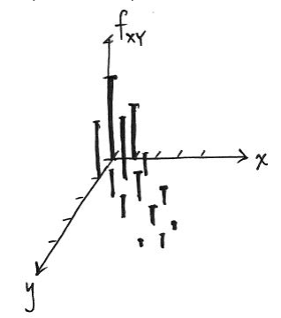
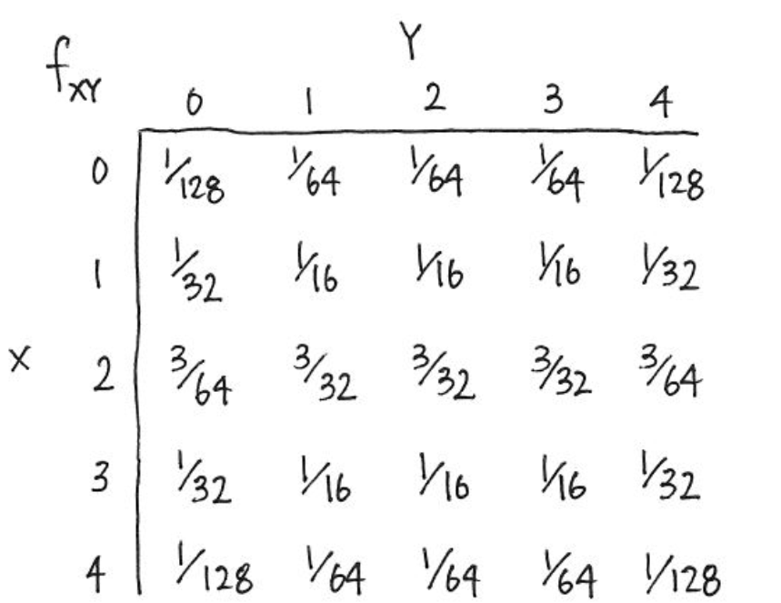

# Module 3: Describing Data, Joint and Conditional Distributions of Random Variables
***


**Module Sections:**

* Summarizing and Describing Data
* Joint, Marginal, and Conditional Distributions
* R Tutorials: Basic Functions
* Module 3: Homework 

Module Content:

* [Summarizing and Describing Data Slides](./files/M3/SummarizingandDescribingDataSlides.pdf)
* [Joint, Marginal and Conditional Probabilities] (./files/M3/JointMarginalandConditionalProbabilities.pdf)


## Summarizing and Describing Data

The goal of visualisation is either EDA for yourself or for conveying a message to other people.  The course uses ggplot in both instances, this module focuses more on EDA for yourself. 

One common way of initially looking at the data is to use a histogram, which provides a rough estimate of the probability distribution function (PDF) of a continous variable.  We can have right open or closed sets when creating histogram bins $[a_i,b_i), [a_{i+1},b_{i+1})$ see this video for a [discussion on binning](https://youtu.be/kREoWbByNZs).

```{r}
library(ggplot2)
require(cowplot)
library(tidyverse)

bihar_data <- read_csv("./files/M3/Bihar.csv")

# keep the females
bihar_adult_females <- dplyr::filter(bihar_data, adult == 1, female == 1)

# take a look at our data
head(bihar_adult_females, 10)

# plot it
ggplot(bihar_adult_females, aes(height_cm)) + 
  geom_histogram()

# not very attractive, so lets tidy it up - there are some outliers close to 0 and 200 cm
bihar_adult_females_trunc <- dplyr::filter(bihar_adult_females, height_cm > 120, height_cm < 200)

# Plot again with colour and labels
ggplot(bihar_adult_females_trunc, aes(height_cm)) + 
  geom_histogram(fill = "blue", color = "darkblue") + 
  xlab("Height in centimeters, Bihar Females (truncated)")

```

We could also adjust the bin width at this point if we wanted to.  The width of the bins depends in part on the volume of data you have, for instance, if you have just 50 observations, picking bin widths of 1 cm might be too much - you can't be sure your data is reliable, there may be quite a lot of noise.  Conversely, if you have a million observations, 1 cm bin widths might be fine.

```{r}
Bihar1 <- ggplot(bihar_adult_females_trunc, aes(height_cm)) + 
  geom_histogram(fill = "blue",color = "darkblue", binwidth = 5) +
  xlab("binwidth = 5")

Bihar2 <- ggplot(bihar_adult_females_trunc, aes(height_cm)) + 
  geom_histogram(fill = "blue",color = "darkblue", binwidth = 10) +
  xlab("binwidth = 10")

Bihar3 <- ggplot(bihar_adult_females_trunc, aes(height_cm)) + 
  geom_histogram(fill = "blue",color = "darkblue", binwidth = 20) +
  xlab("binwidth = 20")

Bihar4 <- ggplot(bihar_adult_females_trunc, aes(height_cm)) + 
  geom_histogram(fill = "blue",color = "darkblue", binwidth = 50) +
  xlab("binwidth = 50")

plot_grid(Bihar1, Bihar2, Bihar3, Bihar4, labels="female height in Bihar", hjust = -1, vjust = 1)
# we could save the results to an image or a file using 
# ggsave("folder/bihargrid.pdf")
```

### Kernel Density Estimation

To give a better and smoother representation of the data, we can use a kernel to visualise the data.  It can be thought of as a smoothed histogram.  

```{r}
ggplot(bihar_adult_females_trunc, aes(height_cm)) + 
  geom_histogram(data = bihar_adult_females_trunc, aes(height_cm, ..density..), fill = "white", color = "darkred") +
  geom_density(kernel = "gaussian", aes(height_cm))
```

In practice, it helps us to calculate our probability density function of the continous variable.  As we previously saw, we cannot find the probability that a particular value of a continous variable is a particular value - it integrates to zero on a infinitley small scale.  Intead, we can calculate the probability that it takes on some particular range of values.  This is where the Kernel Density Estimation or KDE comes in.  

We can draw a KDE with default parameters - a Gaussian distribution and auto bin width and no weights - using the density function.  The autobin width are based on Silverman's rule, which the R help notes

> bw.nrd0 implements a rule-of-thumb for choosing the bandwidth of a Gaussian kernel density estimator. It defaults to 0.9 times the minimum of the standard deviation and the interquartile range divided by 1.34 times the sample size to the negative one-fifth power (= Silverman's ‘rule of thumb’, Silverman (1986, page 48, eqn (3.31))) unless the quartiles coincide when a positive result will be guaranteed.

```{r}
kde = density(bihar_adult_females_trunc$height_cm)
plot(kde)
```

If we were just calculating a density, then the mathmatical calulcation would be different than a KDE.  KDE is like a weighted distribution, based on the individual points.  A KDE has two paramers, K and h

* K = kernel aka the distribution
* h = smoothing parameter aka bin width

There are a number of different kernels, the Guaussian belongs to the un-bounded which means each event in the study region contributes to the estimated density at a specific location.  This determines the overall shape of the curve around each of our observations x.

The smoothing parameter helps to determine at each particular point x, how much other observations around x contribute i.e. how much they are weighted.  A higher bandwidth will result in a smoother curve, but may lead to the curve not fitting the underlying data well.  The smoothing parameter also helps to determine the shape, by determining how far points contribute to the distribution's peak - higher bandwidth results in points further away having an influence on the PDF and results in a flatter curve.  A lower bandwidth conversely means that only points close to our particular observation x will play a part i.e. be weighted, so will result in a peaked curve around our particular x value.

$$\hat{f} ^{Kernel} (x) = \left. {\frac{1}{Nb} \sum_{i=1}^{N} K (\frac{x - x_i}{b})} \right.$$
* [Kernel Density Estimation video](https://www.youtube.com/watch?v=gPWsDh59zdo)
* [List of Kernels in Statistics](https://en.wikipedia.org/wiki/Kernel_(statistics))

Two of the more common Kernels are the Epanechnikov and Normal distribution, with the former being bounded (see second link above). 

* If the bandwidth is too wide, we will not fit the data well and introduce bias, the density plot will look flat and smooth
* If the bandwidth is too narrow, we overfit our data, the density plot will look very peaked and jagged  

The goal is to be somewhere in the middle and to minimise the MSE.  MSE can therefore be thought of as a measure or a quantification of the amount of the bias/variance tradeoff. 

At the extremes, you will introduce some bias, as the kernel will stop at the boundary of the data, so it will tend to create a peak that is too high at the point - it it looking at only the data to the right at the left boundary and vice-versa.  It is easier to see this in practice by looking at plots with higher (wide) bandwidths.

* [Lecture on Bias-Variance Tradeoff, from Caltech EdX course](https://www.youtube.com/watch?v=zrEyxfl2-a8)

Note - we can either use the stat_density function or geom_density - both are used in the following code as examples.  I believe there are more options with stat_density.

```{r}
Bihar5 <- ggplot(bihar_adult_females_trunc, aes(height_cm)) + 
  geom_histogram(data = bihar_adult_females_trunc, aes(height_cm, ..density..), fill = "white", color = "darkred") +
  stat_density(kernel = "gaussian", bw = 1, aes(height_cm), fill = NA, color = "darkblue") +
  xlab("bandwidth = 1")

Bihar6 <- ggplot(bihar_adult_females_trunc, aes(height_cm)) + 
  geom_histogram(data = bihar_adult_females_trunc, aes(height_cm, ..density..), fill = "white", color = "darkred") +
  geom_density(kernel = "gaussian", bw = 5, aes(height_cm), fill = NA, color = "darkblue") +
  xlab("bandwidth = 5")

Bihar7 <- ggplot(bihar_adult_females_trunc, aes(height_cm)) + 
  geom_histogram(data = bihar_adult_females_trunc, aes(height_cm, ..density..), fill = "white", color = "darkred") +
  stat_density(kernel = "gaussian", bw = 10, aes(height_cm), fill = NA, color = "darkblue") +
  xlab("bandwidth = 10")

Bihar8 <- ggplot(bihar_adult_females_trunc, aes(height_cm)) + 
  geom_histogram(data = bihar_adult_females_trunc, aes(height_cm, ..density..), fill = "white", color = "darkred") +
  stat_density(kernel = "gaussian", bw = 20, aes(height_cm), fill = NA, color = "darkblue") +
  xlab("bandwidth = 20")

plot_grid(Bihar5, Bihar6, Bihar7, Bihar8, labels="female height in Bihar", hjust = -1, vjust = 1)
```

The kernel choice doesn't affect the shape of the curve as much as the bandwith.  The following four charts all have the same bandwidth, but different kernels. As previously noted, gaussian is unbounded meaning each point has some weight or contribution to the curve, where as the others are bounded meaning there is a limit as to which points contribute i.e. it has a finite interval.  Rectangular and triangular are the two more unusual shapes compared to the other kernels available.

```{r}
Bihar9 <- ggplot(bihar_adult_females_trunc, aes(height_cm)) + 
  geom_histogram(data = bihar_adult_females_trunc, aes(height_cm, ..density..), fill = "white", color = "darkred") +
  stat_density(kernel = "cosine", bw = 20, aes(height_cm), fill = NA, color = "darkblue") +
  xlab("kernel = cosine")

Bihar10 <- ggplot(bihar_adult_females_trunc, aes(height_cm)) + 
  geom_histogram(data = bihar_adult_females_trunc, aes(height_cm, ..density..), fill = "white", color = "darkred") +
  stat_density(kernel = "epanechnikov", bw = 20, aes(height_cm), fill = NA, color = "darkblue") +
  xlab("kernel = epanechnikov")

Bihar11 <- ggplot(bihar_adult_females_trunc, aes(height_cm)) + 
  geom_histogram(data = bihar_adult_females_trunc, aes(height_cm, ..density..), fill = "white", color = "darkred") +
  stat_density(kernel = "rectangular", bw = 20, aes(height_cm), fill = NA, color = "darkblue") +
  xlab("kernel = rectangular")

Bihar12 <- ggplot(bihar_adult_females_trunc, aes(height_cm)) + 
  geom_histogram(data = bihar_adult_females_trunc, aes(height_cm, ..density..), fill = "white", color = "darkred") +
  stat_density(kernel = "triangular", bw = 20, aes(height_cm), fill = NA, color = "darkblue") +
  xlab("kernel = triangular")

plot_grid(Bihar9, Bihar10, Bihar11, Bihar12, labels="Bandwidth 20, varying kernel", hjust = -1, vjust = 1)
```
### Comparing Distributions

The density we have seen so far is roughly bell shaped, it is uni-modal.  The histogram almost looks like a binomial distribution, once the number of n for the binomial distribution became large enough.  When comparing different distributions on the same chart, if the number of observations is different, it can be moe useful to plot the distributions as densities/proportions.  For instance we can plot US adult height

```{r}
# load the US data 
library(dslabs)
data(heights)

# keep the females,remove sex column and convert to cm
US_adult_females <- dplyr::filter(heights, sex=='Female')
US_adult_females <- US_adult_females[-c(1)]
colnames(US_adult_females)[1] <- "height_cm"
US_adult_females <- cm(US_adult_females)

# take a look at our data
head(US_adult_females, 10)

# plot it
ggplot(US_adult_females, aes(height_cm)) + 
  geom_histogram()

# lets tidy it up as before - there are some outliers close to 0 and 200 cm
US_adult_females_trunc <- dplyr::filter(US_adult_females, height_cm > 120, height_cm < 200)

# Plot again with colour and labels
ggplot(US_adult_females_trunc, aes(height_cm)) + 
  geom_histogram(fill = "red", color = "darkred") + 
  xlab("Height in centimeters, US Females (truncated)")

# Let's plot both US and Bihar data on the same plot and tidy the code a little.  Note we don't need to aes() second time as the col is now the same name, so is applied to both since it is stated in the first line

# Density plot for both
ggplot(bihar_adult_females_trunc, aes(height_cm)) + 
  geom_density(color = "darkblue") +
  geom_density(data = US_adult_females_trunc, color = "darkred") + 
  xlab("Height in centimeters")

# Histogram for both
ggplot(bihar_adult_females_trunc, aes(height_cm)) + 
  geom_histogram(fill = "red", color = "darkred") +
  geom_histogram(data = US_adult_females_trunc, fill = "blue", color = "darkblue") + 
  xlab("Height in centimeters")

```

We can clearly see in this instance the density plot is more appropriate, since the sample is much smaller (n=238) for the US data.

An alternative is to use the cumulative distribution function or CDF.

```{r}
ggplot(bihar_adult_females_trunc, aes(height_cm)) + 
  stat_ecdf(color = "darkred") +
  stat_ecdf(data = US_adult_females_trunc, color = "darkblue") + 
  xlab("Height in centimeters")
```

Note: we could restructure the data at this point in to a single dataframe, so a legend appears.  This is perhaps not the most elegant solution.

```{r}
# first we create a copy of our data with new column names, so they can be combined together and we can identify which is the releveant source
USH <- US_adult_females_trunc 
colnames(USH)[1] <- "US_Heights"
BiharH <- bihar_adult_females_trunc[,5]
colnames(BiharH)[1] <- "Bihar_Heights"

# Next we gather the data i.e. go from wide to long then combine these in a single data frame by adding the rows
USHG <- gather(USH)
BiharHG <- gather(BiharH)
combined <- rbind(USHG,BiharHG)

# Now we can create our plot

ggplot(combined) + 
  stat_ecdf(aes(value, colour = key)) +
  scale_colour_manual(values=c("darkblue", "darkred")) +
  xlab("Height in centimeters") + 
  ylab("Cumulative Distribution")

```

So we can see from the Cumulative Distribution Function that the curve below (US) is taller since at any point, there are fewer people - represented by the CDF - under that point.  It has *First Order Stochastic Dominance or FOSD* - at any height in cm, there are fewer people under it in the US than India.  

It is first order as it is based on shared preferences of possible outcomes and associated probabilities, not risk.  FOSD is often considered in Game Theory and possible outcomes and decisions - statistically it is more likely and therefore better than another possible outcome and we don't have to calculate utility.  Risk aversion or apetite, this is considered under second order stochastic dominance or SOSD.  We woulc consider or calculate utility in SOSD.  Second order considerations come into play when thinking about outcomes that may have very similar or identical expected value e.g. an identical mean.

When comparing CDFs we look at First Order Stochastic Dominance i.e. which curve has it, we also the distance between the two lines and whether the pattern is the same, as it is above, throughout the curve or whether the lines cross and perhaps the dominance changes in a different region.

When comparing the US distribution of the heights vs the Indian one, the first-order stochastic dominance of the US distribution means that we are more likely to find larger height values in the US data.

* [What is stochastic dominance](https://www.youtube.com/watch?v=6iE_5y4r2FI)

## Joint, Marginal and Conditional Probabilities

We previously ended the Math lecture from M1 on joint probabilities, we can look at another example.  This time suppose we have a function $F_{xy}(x,y)$ where the function is $cx^2y \; for \; x^2 <= y <= 1 $ and is 0 otherwise and we want to calculate the probability for the joint PDF.  

Note: c is the normalizing constant and ensures that our probability function as given becomes a PDF with a total probability of one i.e. it integrates to one.

First, we draw the support of this distribution i.e. where on the xy-plane there is positive probability.  This is the element which is non-zero given above.

```{r support 2D, echo = FALSE, out.width = "100%"}
knitr::include_graphics("images/jointsupport2D.png")
```

We can also show this as three dimensional.

```{r support 3D, echo = FALSE, out.width = "100%"}
knitr::include_graphics("images/jointsupport3D.png")
```

Next, we integrate over this support area

$$∫_{-1}^{1}∫_{x^2}^{1}cx^2ydydx = \frac{4}{21} c$$

We can use the PRACMA package to calculate the value as follows.

```{r}
library(pracma)
f <- function(x,y) x^2*y
xmin <- -1; xmax <- 1
ymin <- function(x) x^2; ymax <-1
integral <- integral2(f, xmin,xmax,ymin,ymax)
integral$Q 
```

Which is the value of integral without c, but since we need c⋅integral without c = 1 we can find c simply by 1/ integral

```{r}
library(MASS)
1 / integral$Q 
fractions(1 / integral$Q )
```

So c = 21 / 4 (which is 5.25).  We can now use this value of c in our joint PDF formula

$$F_{xy}(x,y) = 5.25 x^2y \; for \; x^2 <= y <= 1 \; and \; 0 \; otherwise$$

Using this formula we can calculate proabilities of certain region, such as the probability that x > y.  To do so, we use the double integration over the region described by the probability statement e.g. x > y.  As before, we can draw the support region, then integrate over the area between the boundaries of the area (the lines) and the support.  Using multivariable calculus, we set the limits of the integration then perform the integration.  By substituting in our value of c we have:

$$∫_{1}^{0}∫_{x^2}^{x}5.25x^2ydydx = \frac{3}{20}$$
We can now calculate this as before
```{r}
f <- function(x,y,c) c * x^2 * y
c <- 5.25
xmin <- 1; xmax <- 0
ymin <- function(x) x^2; ymax <-function (x) x
I<- integral2(f, xmin,xmax,ymin,ymax, c = c) 
I$Q 
1 / I$Q
fractions(1 / I$Q) # as a fraction
```

### Marginal or Individual Distributions

So far, we have looked at how to calculate regions of the xy plane, by integrating the PDF$F_{xy}$ over the regions. We can also use this joint PDF to recover individual or *marginal* distributions.

For discreet random variables for a particular value of x, we sum up the joint distribution over all the values for Y, to give the marginal distribution of x at that points.  For continous variables we do the equivalent integration.

Discreet:

$$ f_X(x) = \sum_y f_{xy}(x,y) $$

Continous:

$$f_X(x) = \int_{y} f_{xy}(x,y)dy$$

This is best illistrated with an example.  In tennis players tend to play at a similar level to the their opponent, if they are broadly at a similar level.  So if one player is playing badly, so will the other.  This suggests that the shape of joint PF of unforced errors in the game will be concentrated at points around which x and y have similar values, with less density (probability) around the points where one player has a lot more unforced errors than the other.  The PF may look something like the one below.

```{r Joint PF of unforced errors, echo = FALSE, out.width = "100%"}

```

To calculate the marginal/individual probabilities for one player, we just sum the probabilies - for each x, add up all the probabilities of y.  We take a straight line at x and sum all the probabilities along that line/vector.

In our example, if we want to find the marginal PDF of a continous variable x, we simply integrate out y.  Bearing in mind our conditions as before $cx^2y \; for \; x^2 <= y <= 1 $ and is 0 otherwise:

$$f_X(x) = \int_{x^2}^{1} 21/4 \; x^2ydy$$

If we wanted to find the marginal PDF of a y (a continous variable), we integrate out x in a similar fashion, again using the conditions as before.

$$f_y(y) = \int_{\sqrt{-y}}^{\sqrt{y}} 21/4 \; x^2ydx$$
More detail and charts are available in the slides at the top of this chapter.

### Independence of Random Variables

We have seen how to recover the marginal distributions from a joint distribution.  Can we also construct the joint distribution from the marginal distribution?  No we cannot, unless we know the relationship between the random variables.  Joint distributions contain three pieces of information: how one variable is distributed, how a second variable is distributed, and the relationship between the two variables. Having the marginal distributions gives the first two pieces of information, but it does not give us information about how the two variables are related.

Independent random variables is often an assumption for some models and is a particular type of relationship between two variables.  

X and Y are independent if the joint PDF is equal to the product of the marginal PDFs e.g. $fxy(x,y)=fx(x)fy(y)$

In our last example where the value of y takes on values depending on the value of x $cx^2y \; for \; x^2 <= y <= 1 $ so they are supported, so no they are not indepdent.  

In the earlier of tennis unforced errors, our indepdendence definition is that x and y are independent if the probability that x is in some region and y is in some region is equal to the product of the probabilities for all regions a and b.  There are regions where there is no probability (zero probability) in the joint probability function, yet the product of the two marginal distributions is non-zero. So this definition is not met.

For discrete random variables, if you have a table representing their joint probability function, the two variables are independent if and only
if (iff) the rows of the table are proportional to one another, if and only if (iff) the columns of the table are proportional to one another - see below.  The columns are simply ratios of the other columns.  

If in the tennis example the unforced errors were indepdent, this is what the table of joint distributions would look like.

```{r Independent Discreet Random Variables, echo = FALSE, out.width = "100%"}

```

### Conditional Distributions

The conditional distribution allows us to "update" the distribution of a random variable, if we need to, given some information for instance y | x or number of unforced errors for y given x.  Mathematically it is the joint PDF divided by marginal PDF:

$$FY|x (y|x) = fxy(x,y) / fx(x) \\ where \; P(Y=y |X=x) \; for X,Y discreet$$
In effect, it will behave like a marginal probability once we have conditioned (stated) on the x variable.

Note that we we condition (state) on one variable, the marginal probabilities at that point (slice) do not integrate to 1.  So using the tennis example beofre, if one player has made 2 unforced errors (y = 2) so we are interested in the PDF of x at that point, we need to inflate the PDF by the probability that y = 2 or P(y = 2) which is 5/32 or 0.156 and we divide each of the individual probability to effectively gross-up the probabilities to 1. 

For a continous conditional PDF, we normalise the marginal probability for one variable to effectively gross that up also.

## Homework

This is a sample of some of the homework answers.

### Part 1

We use the gender stats from the [world bank](https://datacatalog.worldbank.org/dataset/gender-statistics).  In this case we are just interested in analyzing the data for one indicator that is the Adolescent Fertility Rate, in the data the indicator code for this variable is called SP.ADO.TFRT . This indicator measures the annual number of births to women 15 to 19 years of age per 1,000 women in that age group. It represents the risk of childbearing among adolescent women 15 to 19 years of age. It is also referred to as the age-specific fertility rate for women aged 15-19. Once you have completed this problem set you’ll have more information of how this rate has evolved over time and how it varies across different groups of countries.

```{r}
rm(list = ls()) # Removes all existing R objects
library(utils)
library(tidyverse)

gender_data <- as_tibble(read.csv("./files/M3/Gender_StatsData.csv"))

head(gender_data, n = 20)
str(gender_data)
summary(gender_data)
```

Now if we only want adolescent fertility rate for each county-year we do the following.

```{r}
teenager_fr <- filter(gender_data, Indicator.Code == "SP.ADO.TFRT")
```

Nest we remove the object from memory since we no longer need it.

```{r}
rm(gender_data)
```

Then to calculate the sample mean of the Adolescent FR in 1975

```{r}
mean(teenager_fr$X1975, na.rm = TRUE)
```

Then for the mean and sd of the Adolescent FR in 1960

```{r}
round(mean(teenager_fr$X1960, na.rm = TRUE),2)
round(sd(teenager_fr$X1960, na.rm = TRUE),2)
```

And the same again in 2000

```{r}
round(mean(teenager_fr$X2000, na.rm = TRUE),2)
round(sd(teenager_fr$X2000, na.rm = TRUE),2)
```

Question 9

```{r}
byincomelevel <- dplyr::filter(teenager_fr, Country.Code %in% c("LIC","MIC","HIC"))
colnames(byincomelevel)[1] <- "Country.Name"
byincomelevel
```

Now we want to gather the data ready for plotting - note gather uses key,value setup.  In this instance, our first var is the new variable (key) we wish to setup using the transposed data.

```{r}
plotdata_bygroupyear <- gather(byincomelevel, Year, FertilityRate, X1960:X2015) %>%
  select(Year, Country.Name, Country.Code, FertilityRate)
head(plotdata_byyear)
```

If we prefer to look at the data at the year level, and have the fertility rates for each income-group as separate variables, we need to re-arrange the data using the spread command.  To do so, wE list the variables we want to rotate out i.e. those that will become new  columns/var and the data.

```{r}
plotdata_byyear <- select(plotdata_byyear, Country.Code, Year, FertilityRate) %>%
  spread(Country.Code, FertilityRate)
head(plotdata_byyear)
```

Now we can plot our data, first we remove the x label from the start of the year variables to allow us to convert the chr string to a numeric field, which in turn will make the axis easier to read

```{r}
# Remove the x and convert to numeric
plotdata_bygroupyear <- mutate(plotdata_bygroupyear, Year=as.numeric(str_replace(Year,"X","")))

# Plot the resulting data
ggplot(plotdata_bygroupyear, aes(Year, FertilityRate, group = Country.Code, colour = Country.Code)) +
  geom_line() + 
  labs(title='Fertility Rate by Country-Income-Level over Time')
```

```{r}
histdata_twoyears <- teenager_fr %>%
  dplyr::slice(46:263) %>%
  dplyr::select(X1960, X2000) %>%
  gather("Year", "FertilityRate")

ggplot(histdata_twoyears, aes(x = FertilityRate, group = Year, colour = Year, fill = Year)) + 
  geom_histogram(aes(y = ..density..), alpha = 0.1) +
  geom_density(alpha = 0.1, bw = 5) 
```


### Part 2

Question 3 - what is the value of c in this case

$$∫_{0}^{1}∫_{0}^{1}c(x+y^2)dydx$$

We can use the PRACMA package to calculate the value as follows.

```{r}
library(pracma)
f <- function(x,y) x + (y^2)
xmin <- 0; xmax <- 1
ymin <- 0; ymax <-1
integral <- integral2(f, xmin,xmax,ymin,ymax)
integral$Q 
```

Which is the value of integral without c, but since we need c⋅integral without c = 1 we can find c simply by 1/ integral

```{r}
library(MASS)
1 / integral$Q 
fractions(1 / integral$Q )
```

Question 4 - Plot the bivariate PDF

```{r}
library(plot3D)

# Create the x and y vectors

M <- mesh(seq(0,1, length = 100), seq(0,1, length = 100))
x <- M$x
y <- M$y
z <- 6/5*(M$x + M$y^2)

# Plot the pdf
persp3D(x, y, z, xlab = 'X variable', ylab = 'Y variable', xlim = c(0,1), main = 'Plotting joint PDF')
```

The plot is correct - the pdf can take values larger than one. Both X and Y are continuous random variables, the important thing is that they jointly integrate to one, which can be met by having a value of the constant c that ensures this.
