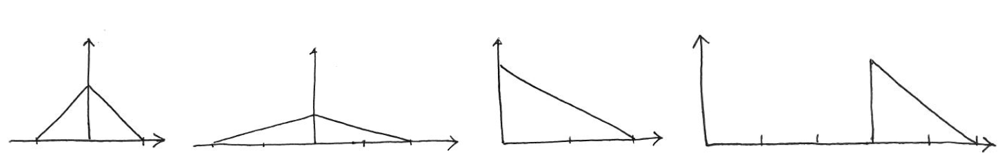
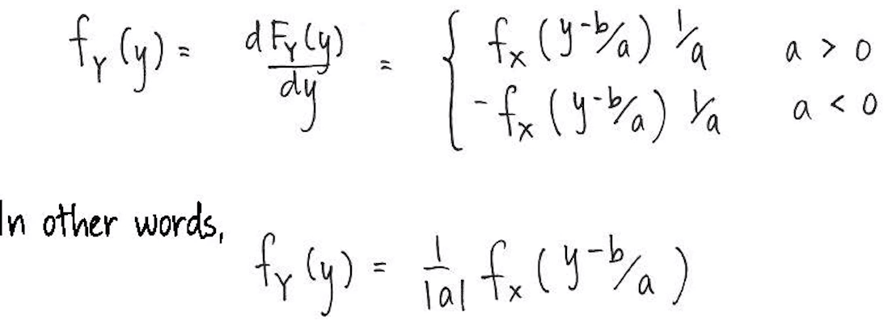

# Module 4: Describing Data, Joint and Conditional Distributions of Random Variables
***


**Module Sections:**

* Functions of Random Variables
* Moments of a Distribution
* Expectation, Variance, and an Introduction to Regression
* Module 4: Homework

Module Content:

* [Joint, Marginal and Conditional Probabilities] (./files/M3/JointMarginalandConditionalProbabilities.pdf) <- last few slides start this module
* [Functions of Random Variables](./files/M4/FunctionsOfRandomVariables.pdf)


## Functions of Random Variables

Before discussing statistics, we need to understand probability and how random variables behave.  

Suppose we have some random variable x, we want to know how a new random variable Y = h(X) (some function of x) is distributed.  If we have a distribution $Y = |2x| + 3$ where X has a PDF $f_x(x) = 1 - |x| \; for -1 <= x <= 1$. We can think about what each element does to the random variable as we move from x to y as shown below e.g. we start with x, then move to 2x, then to the absolute value of X then in the final image we add 3 three which moves the distribution along to the right.

```{r Function of a Random Variable, echo = FALSE, out.width = "100%"}

```

There are various approaches to finding out the distribution of a function of random variables, however the full range of methods is beyond the scope of this class.  What the course does cover is one important method which can be applied generally.

If we have a random variable x and it has a PDF $f_x(x)$ and we want the distribution of y which is some function h of the random variable x e.g. $Y = h(y)$.
One way we can find h is by first finding the CDF of y, which we find by integrating the PDF of x over the region x such that h(x) <= y.  Then, when we have the CDF of y, then if it is continous, we take the derivate $f_y(y) = dF_y(y) / dy$.  If it is a discreet RV, the approach is different to find the PF of the CDF.

* For a continous variable the important thing is that we "integrate over the appropriate region" then we take the derivate to find the PDF

If we wanted to find the CDF, this is obtained by integrating the PDF, so to obtain the density from the CDF you would need to differentiate the CDF.

In the course we will look at 4 types of examples:

1. Linear transformation of a single random variable
2. Probability integral transformation
3. Convolution
4. Order statistics

### Linear Transformation

We often want to transform one variable in to another, for instance by using a linear transformation.  An example would be converting feet in to meters.  OR there may be some underlying theory which relates one variable to another.  As before, if we want to understand how Y is distributed we "integrate over the appropriate region". We typically want to take the region which excludes the situation where the variable is 0 since this would give us a "degenerate" RV which is actually a point mass (at 0).  For $Y = aX + b$ Y is distributed $ FY(y) = P(Y <= y) = P(aX+b <= y)$.  a could be positive or negative so we end up with two statements - a negative and positive one.   To find out Y, we integrate over the region of the statement of x we are interested in.

```{r Linear Transform, echo = FALSE, out.width = "100%"}
knitr::include_graphics("images/linearRV.png")
```

In the second case wehre a > 0, we can re-write it as shown so that it becomes 1 minus the value when a < 0.  To get the PDF we then take the derivative:

```{r Linear Derivative, echo = FALSE, out.width = "100%"}

```

### Probability integral transformation

Here we use the CDF which describes the distribution of a random variable to transform a random variable - PDF fx(x) and CDF Fx(x) where Y = Fx(X) (big X).  The CDF is a function, so we can use it. Whatever the support of X,Y lives on [0,1]. This is because the Y is a CDF. The result is that a continous RV transformed by it's own CDF will always have a uniform distribution i.e. U[0,1].

But - why would we use this?  When writing code, we might want to take random draws from some distribution.  For example, when looking at sumulating random draws from a uniform distribution to look at the proportion of a school population initially infected with a virus and another set of simulations from a beta distribution to model the humidity, which perhaps might influence the spread of the virus.  Some software languages and or packages may not include all these distributions, but most likely you can use a uniform distribution, so instead we use the uniform but look up the CDF of a distribution we are interestred e.g. beta distro from a book, then compute the inverse CDFs, and then use those functions to transform the random draws as from a uniform 0,1 into random draws from say the beta distro.  

### Convolution in the Context of Probability

Convolution refers to the sum of independent random variables, we previoulsy saw one in the case of the pills in the headache example - the sum of the pills effective lives was of interest.  Another example might be stocks in a portfolio. 

So if we have two independent items - PDF of X is Fx and PDF of Y is Fy and Z is their sum, we can find thed PDF of Z.  IF we know they are independent, we can get the joint PDF by multiplying the margainl PDFs e.g. Fxy(x,y) = Fx(x)Fy(y).  The slides contain step by step examples with double integration.

Note that independence is not a requirement for you to be able to find the PDF of the sum of random variables. However, independence does make it very easy to find the joint PDF of random variables, because if you know they are independent, then the joint density is just given by the product of their marginal densities.

### Order Statistics

Order statistics are very useful in Economic modelling, specifically auctions.  If we have a list of some random variables X1 ... Xn which are i.i.d. A group of random variables is called a random sample.  Yn = max{X1, ... ,Xn} this is called the nth order statistic.  Often in statistics we will talk about a set of i.i.d.s and this is part of our first assumption.  

Sometimes these different terms are used interchangeably - random variables, random samples, i.i.d.s and are soemtiems termed together.  

We are often interested in how the nth order statistic is distributed. 